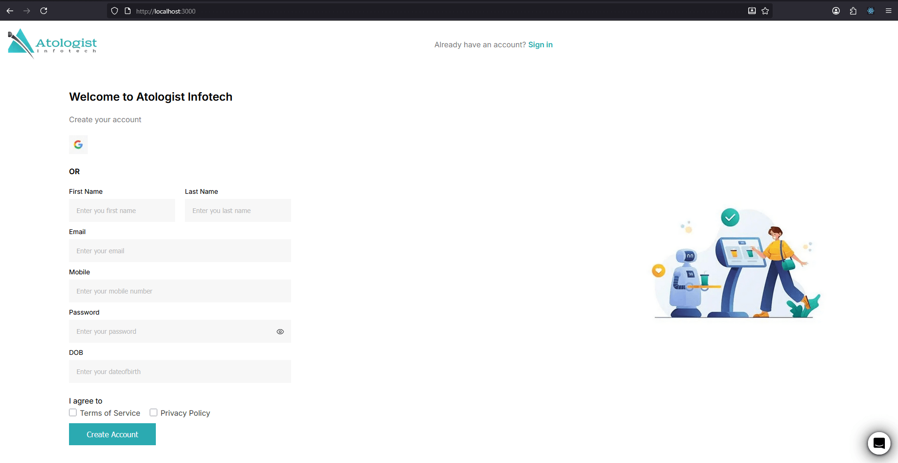

# Alternate Signup (Next.js + SCSS)




## 📌 Overview

This project implements a responsive **Alternate Signup** page in _React(Next.js)_ and SCSS based on the provided [Figma Design](https://www.figma.com/file/SuBLMVyz3I3va90XPXoI9l/Alternate-Signup?type=design&node-id=1-27&mode=design&t=upiPlslFw7YVPv1T-0)

Checkout demo at: [Live Demo](https://alternate-signup.netlify.app)
### 🚀 Tech stack and libraries used

- ReactJS
- Next.js (React framework)
- TypeScript (for type safety)
- SCSS (for styling)

**Libraries used**:

- **Zod**: Schema validation with type safety
- **React-Hook-Form**: For efficient form handling and client-site validation
- **Axios**: Handling HTTP requests
- **Bcryptjs**: For Encryption of password
- **Sonner**: For real-time feedback to user using toasts

### ⚙️ Setup and Installation

This project was bootstrapped using `pnpm`

```bash
# Clone repo
git clone https://github.com/thesevenn/alternate-signup.git
cd alternate-signup

# install dependencies
pnpm install
# or using npm
npm install

# run the app
pnpm run dev
# or using npm
npm run dev
```

Visit the application on your browser at: [localhost:3000](http://localhost:3000)

### 🌐 API Validation

As per the instructions, Signup request is sent to
[https://atologistinfotech.com/api/register.php](https://atologistinfotech.com/api/register.php)

**With fields**:

```txt
firstname,
lastname,
mobile,
email,
dob,
encryptpassword
```

Where `encryptpassword` field is encrypted `password`.

> [!NOTE]
> I have utilized Next.js api route handler to overcome the `CORS` Blocking requests in browsers

> [!WARNING]
> The provided API endpoint (`/register.php`) consistently responded with `500 Internal Server Error`, even with correctly structured POST requests.  
> To demonstrate functionality, the app still performs client-side validation and sends requests via Next.js API routes.

### Features as per instructions

- The application is responsive across all the devices
- The UI matches Figma design closely
- Used exact Typography and colors
- Implemented restful API with proper error handling and feedback to users.
- Implemented Client-side validation on forms
- Tested for compatibility with all major browsers (`chrome`, `firefox` and `edge`)

### Performance and optimization

- Optimized and compressed image and icon assets without losing quality.
- Kept dependencies minimal for better performance.
- Optimized for performance with `98` performance score in **Lighthouse**.
